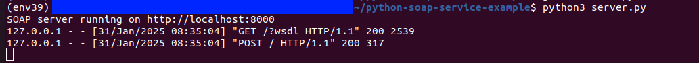
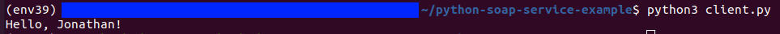

# Python SOAP Service Example

## Overview
This project demonstrates a simple SOAP web service in Python using `Spyne` for the server and `Zeep` for the client. The service provides a `say_hello` operation that returns a greeting message.

- **SOAP Server**: A Python script that exposes a SOAP service to respond to client requests.
- **SOAP Client**: A Python script that consumes the SOAP service and prints the response.

## Features
- SOAP server with `Spyne`
- SOAP client with `Zeep`
- WSDL auto-generation
- Simple `say_hello` operation
- XML message exchange

## Screenshots

### Server Screenshot:


### Client Screenshot:



## Prerequisites
- Python 3.x
- `Spyne` and `Zeep` libraries (install via pip)

## How to Use

### 1. Clone the Repository
Clone the repository to your local machine:

```bash
git clone https://github.com/Jonahida/python-soap-service-example.git
cd python-soap-service-example
```

### 2. Create a Virtual Environment
It's recommended to create a virtual environment to manage dependencies.


- On **Linux/MacOS**:

```bash
python3.9 -m venv env39
source env39/bin/activate
```

- On **Windows**:

```bash
python3.9 -m venv env39
env39\Scripts\activate
```

### 3. Install Dependencies

With the virtual environment activated, install the required libraries:

```bash
pip3 install spyne zeep
```

### 4. Run the SOAP Server
To start the SOAP server, run the following command:

```bash
python server.py
```

The server will start and listen at `http://localhost:8000/?wsdl`.

### 5. Run the SOAP Client

To consume the **SOAP service** and get the response, run the following command in a different terminal:

```bash
python client.py
```

Expected output:

```bash
Hello, <your_name>!
```

Example Output

Client:

```bash
python client.py
```

Output:

```bash
Hello, Jonathan!
```

Server:

```bash
python server.py
```

Output:

```bash
SOAP server running on http://localhost:8000
```

### 6. Stop the Server

To stop the server, simply press `Ctrl+C` in the terminal where the server is running.

## Project Structure

```bash
python-soap-service-example/
│── server.py   # SOAP server using Spyne
│── client.py   # SOAP client using Zeep
│── README.md   # Project documentation
```
## Code Explanation

### `server.py`

This file defines the SOAP server that exposes the `say_hello` method as a SOAP service.

```python
from spyne import Application, rpc, ServiceBase
from spyne.protocol.soap import Soap11
from spyne.server.wsgi import WsgiApplication

class HelloWorldService(ServiceBase):
    @rpc(str, _returns=str)
    def say_hello(ctx, name):
        return f"Hello, {name}!"

# Create the SOAP application
application = Application([HelloWorldService], 
                          tns='spyne.examples.helloworld',
                          in_protocol=Soap11(),
                          out_protocol=Soap11())

# Create the WSGI application
wsgi_application = WsgiApplication(application)

if __name__ == '__main__':
    from wsgiref.simple_server import make_server
    server = make_server('127.0.0.1', 8000, wsgi_application)
    print("SOAP server running on http://localhost:8000")
    server.serve_forever()
```

- **Imports**: We import necessary modules like `Application`, `rpc`, `ServiceBase`, and `Soap11` from the `Spyne` library, which are essential for creating the SOAP service.
- **HelloWorldService**: This class defines the `say_hello` method, which takes a `name` parameter (a string) and returns a greeting message. The `@rpc(str, _returns=str)` decorator tells Spyne that this method should be exposed as a SOAP operation that accepts and returns a string.
- **WSDL Definition**: The Application object binds the service to the SOAP protocol and sets the WSDL (Web Services Description Language). The `tns` (target namespace) is defined as `spyne.examples.helloworld`.
- **Server**: The WSGI application is created using `WsgiApplication`, and the server is started using `make_server` from `wsgiref.simple_server`. The server listens on `http://localhost:8000/?wsdl` to expose the SOAP service.


### `client.py`

This file defines the SOAP client that consumes the say_hello service.
```python
import zeep

# Define the SOAP client
wsdl = 'http://localhost:8000/?wsdl'

client = zeep.Client(wsdl)

# Call the SOAP service
name = "Jonathan"
response = client.service.say_hello(name)

print(response)
```

- **Imports**: We import the `zeep` library, which is a Python library for consuming SOAP services.
- **WSDL URL**: The `wsdl` variable points to the URL of the SOAP service's WSDL, which describes the operations available for the client.
- **Client Setup**: The `zeep.Client(wsdl)` initializes the client with the WSDL URL. This allows the client to interact with the SOAP service.
- **Service Call**: The `client.service.say_hello(name)` is called to invoke the `say_hello` operation on the SOAP server. The `name` parameter is passed, and the response is captured in the `response` variable.
- **Output**: The client prints the response from the server, which is expected to be a greeting message like `Hello, Jonathan!`.

# Contributing

Contributions are welcome! To contribute to this project:

- Fork the repository.
- Create a new branch for your feature or bug fix.
- Submit a pull request or open an issue to discuss any enhancements or bug fixes.

# License

This project is licensed under the MIT License. See the LICENSE file for details.
